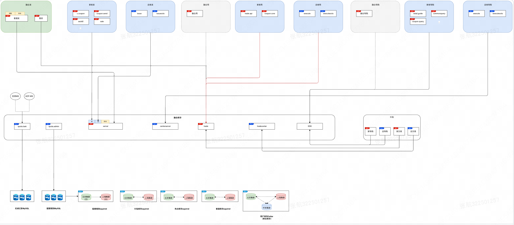
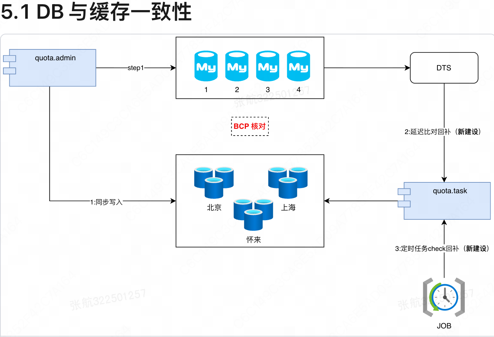
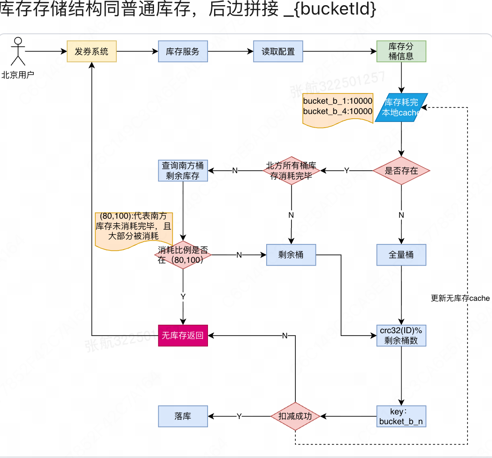

# 库存系统设计

<!-- TOC -->

---

# 1. 系统概述

## 1.1 背景与定位

库存服务负责扣减、查询和回滚等关键操作。它是活动的"水闸"——严格保障不超，同时尽可能不少，是整条链路的基础设施之一。

## 1.2 核心职责

- **发放总量管控**：对优惠券发放数量（总量、日量、总金额、日金额）进行精细化限制
- **单用户限额**：按用户 ID、手机号、设备 UUID 三个维度管控单用户可领次数
- **补贴库存管控**：独立维护补贴方案维度的库存
- **跨维度原子扣减**：多类型库存同时扣减，任一失败则整体回滚
- **批量库存查询**：支持查询各维度已消耗量，辅助上游系统决策
- **扣减前预校验**：在实际扣减前进行预判，过滤无效请求
- **运维管理能力**：通过 admin 模块管理配置，通过 task 模块处理异步任务

## 1.3 术语说明

| 术语 | 描述 |
| --- | --- |
| 库存 | 对配置维度、用户维度、协同维度、补贴维度等各类限频限次的计数，统称为库存 |
| 配置库存 | 与用户无关的配置维度库存，涵盖发、用两个阶段 |
| 用户库存 | 针对某配置，用户可领取的次数上限，支持 userId / phone / uuid 三个维度，任一超限则失败 |
| 协同库存 | 跨券的用户维度库存，支持发、用两个阶段 |
| 补贴库存 | 与用户无关，按补贴方案维度进行计数管控 |

---

# 2. 架构设计

## 2.1 整体架构概览

系统采用多区域部署方案，上游调用方（如发券链路、补贴链路）通过 Thrift RPC 接入 `quota.server`（C端）和 `quota.admin`（M端），由 `quota.task` 处理异步任务，底层依赖 Squirrel（Redis）、Cellar（Tair）和 MySQL 三层存储。



## 2.2 Squirrel 存储方案

系统在北区（N/Beijing）和南区（S/Shanghai）各部署独立的 Squirrel 集群，支持双向同步，具备以下特性：

- **就近读写**：扣减时优先操作本 Region 的存储
- **跨 Region 降级**：本区库存不足时，自动 failover 至另一区重试
- **双向同步**：两个 Region 数据互相同步，保障可用性
- **本地扣减，全局查询**：扣减只写本 Region，查询聚合两个 Region 的数据

### 2.2.1 库存规则缓存

| key | Value                                        | 有效期              |
| --- | --- | --- |
| `t={bizType}, i={bizId(_bizDim)}` | `quotaType1:{rule1}`<br>`quotaType2:{rule2}` | 规则过期时间 + 30天 |

### 2.2.2 普通配置库存

| 类型 | key | Value | 有效期              |
| --- | --- | --- | --- |
| 总库存/总金额 | `K{bizType}_{quotaType}_{bizId}` | N:5<br>S:5 | 配置过期时间 + 90天 |
| 日库存/日金额 | `D{yyyyMMdd}K{bizType}_{quotaType}_{bizId}` | N:5<br>S:5 | 固定 2天            |

### 2.2.3 热点分片库存

| 类型 | key | Value | 有效期 |
| --- | --- | --- | --- |
| 总库存/总金额 | `{regionName}_{bizType}_{quotaType}_{bizId}_{bucketNo}` | stock:5 | 继承库存类型 |
| 日库存/日金额 | 同上，加日期前缀 | stock:5 | 继承库存类型 |

### 2.2.4 补贴库存

| 类型 | key | Value | 有效期 |
| --- | --- | --- | --- |
| 日库存/日金额 | `QS{bizType}_{quotaType}_{bizId}_{day}` 或带 bizDim | N:5<br>S:5 | 固定 2天 |
| 总库存/总金额 | `QS{bizType}_{quotaType}_{bizId}` 或带 bizDim | N:5<br>S:5 | 规则过期时间 + 90天 |

### 2.2.5 回滚记录

| key | Value | 有效期 |
| --- | --- | --- |
| `K{bizType}_BID{bizId}_{quotaType}_{idempotentSign}` | - | 固定 30天 |

## 2.3 Cellar 存储方案

### 2.3.1 用户库存（三向同步）

| 类型 | Key | Value | 有效期 | 备注 |
| --- | --- | --- | --- | --- |
| 用户总领取限制 | `U_T_{migrate}_{biz_type}_{quota_type}_{biz_id}_{userId}` | 已消耗量 | 库存 etime + 60天 | |
| 手机号总领取限制 | `P_T_{migrate}_{biz_type}_{quota_type}_{biz_id}_{phone}` | 已消耗量 | 库存 etime + 60天 | |
| uuid 总领取限制 | `UUID_T_{migrate}_{...}_{uuid}` | 已消耗量 | 库存 etime + 60天 | |
| 用户 X 天领取 Y 张 | `U_{migrate}_{yyyymmdd}_{...}_{userId}` | 已消耗量 | X天 + 30天 | 查询时聚合前 X-1 天数据 |
| 手机号单日限制 | `P_{migrate}_{yyyymmdd}_{...}_{phone}` | 已消耗量 | 24H | |
| uuid 单日限制 | `UUID_{migrate}_{yyyymmdd}_{...}_{uuid}` | 已消耗量 | 24H | |

## 2.4 数据库（MySQL）

### 2.4.1 库存规则表（quota_rule）

| 字段 | 类型 | 说明 | 示例 |
| --- | --- | --- | --- |
| id | bigint | 主键，无业务含义 | - |
| biz_id | varchar(64) | 业务资源 ID | 券配置ID、协同ID |
| biz_type | tinyint | 业务类型 | 见 BizType 枚举 |
| biz_dim | varchar(128) | 业务维度 | 如补贴方案维度 |
| quota_type | int | 库存类型 | 总库存、日库存、总金额等 |
| quota_info | varchar(1024) | 库存详细信息 | JSON 格式 |
| shard_type | tinyint | 分片类型 | 1-不分片，2-分片 |
| shard_info | varchar(1024) | 分片详细信息 | JSON 格式 |
| total_num | bigint | 可发总量 | |
| used_num | bigint | 已发数量（异步写回） | |
| depleted_time | bigint | 库存耗尽时间戳（0=未耗尽） | |
| expire_time | bigint | 过期时间（ms） | |
| ext_info | text | 扩展信息，透传至 C 端查询结果 | |
| create_time | bigint | 创建时间（ms） | |
| update_time | bigint | 更新时间（ms） | |
| modifier | varchar(64) | 修改人 | mis 账号 |
| outer_version | bigint | 外部数据同步版本号 | |
| version | bigint | 内部版本号 | |

### 2.4.2 扣减流水表（quota_record）

| 字段 | 类型 | 必填 | 描述 |
| --- | --- | --- | --- |
| id | bigint | 主键 | 无业务含义 |
| bizId | String | 是 | 业务 ID |
| bizTypeEnum | QuotaBizTypeEnum | 是 | 业务类型枚举 |
| idempotentSign | String | 是 | 幂等标识，防止重复操作 |
| perDeductNum | long | 是 | 单次扣减数量 |
| perDeductAmount | long | 是 | 单次扣减金额 |
| quotaDeductTime | long | 是 | 扣减时间戳，用于日库存回退对账 |
| rollBackType | int | 是 | 回滚类型 |
| quotaRuleTypeList | List\<Integer\> | 否 | 参与此次扣减的规则类型列表 |
| atocmicKey | String | 是 | 原子操作 key |
| extra_info | varchar(1024) | 否 | 扩展信息 |
| create_time | bigint | - | 创建时间（ms） |
| update_time | bigint | - | 更新时间（ms） |

## 2.5 服务划分

| 服务模块 | 职责 | 是否 Set 化 |
| --- | --- | --- |
| server | C 端：查询、校验、扣减、回退 | 是 |
| servercenter | C 端：查询、校验（中心化） | 否 |
| admin | M 端服务，配置管理 | 否 |
| task | 异步任务处理 | 否 |

## 2.6 系统约束

1. 北区到南区的数据同步延迟约 20～30ms；
2. 扣减接口不支持幂等，回退接口支持幂等；
3. 核心原则：严格不超发，尽最大努力不少发。

---

# 3. 库存类型与维度

**新增类型原则**：扣减入参为 bizType + bizId，一次请求扣减所有 quotaType。若多个维度需同时扣减，则新增 quotaType；若属于不同场景下的独立扣减，则新增 bizType。

## 3.1 业务类型（BizType）

> 说明：接入新业务不一定需要新增枚举；BizType 代表的是库存使用场景，而非接入方身份。

| biz_type | 含义 | 说明 |
| --- | --- | --- |
| 1 | 旧券 | 历史老类型 |
| 2 | 发券 | 包含发券流程的配置维度库存和用户维度库存 |
| 3 | 用券 | 包含核销金额配置和用户核销次数限制 |
| 4 | 协同发券 | 协同维度库存（发） |
| 5 | 协同用券 | 协同维度库存（用） |
| 6 | 神券补贴用券 | 补贴类型的用券库存 |

## 3.2 库存类型（QuotaType）

| quota_type | 含义 | quota_info | 存储位置 | 备注 |
| --- | --- | --- | --- | --- |
| 1001 | 总量限制 | - | Squirrel | |
| 1002 | 单日限制 | - | Squirrel | |
| 1003 | 时段库存 | JSON：`{"hourStockInfo": {"0100-1205": 130}}` | Squirrel | 支持按时段设置库存 |
| 2001 | 总金额 | - | Squirrel | 单位：分 |
| 2002 | 日金额 | - | Squirrel | 单位：分 |
| 3001 | 用户总限制 | JSON：`{"limitScope": "user,uuid,phone"}` | Cellar | 三码合一或单一维度 |
| 3002 | 用户周期天限制 | JSON：`{"cycle": 7, "limitScope": "user,uuid,phone"}` | Cellar | cycle 最大值 30，需谨慎配置 |

## 3.3 分片类型（ShardType）

| shard_type | 含义 | shard_info | 备注 |
| --- | --- | --- | --- |
| 1 | 不分片 | 无 | |
| 2 | 分片 | `{"N":{"num":4,"numDetail":{"1-4":50}},"S":{"num":6,"numDetail":{"1-6":50}},"bucketNum":10}` | 针对秒杀/抢券场景 |

## 3.4 回退类型（RollbackType）

| RollbackType | 描述 | 说明 |
| --- | --- | --- |
| 1 | 客户端回退 | 接口响应超时后，由客户端主动发起回退 |
| 2 | 业务回退 | 业务层失败（如券发放失败）触发，不校验流水，直接回滚 |
| 3 | 扣减失败回退 | 系统内部异常时，自动回退已成功的扣减量 |

## 3.5 维度映射汇总

| 库存维度 | biz_type | quota_type | shard_type | 备注 |
| --- | --- | --- | --- | --- |
| 【发】配置-总库存 | 2 | 1001 | 1 或 2 | 分片时存储分片信息 |
| 【发】配置-单日库存 | 2 | 1002 | 1 或 2 | |
| 【发】配置-总金额 | 2 | 2001 | 1 | |
| 【发】配置-单日金额 | 2 | 2002 | 1 | |
| 【发】用户-总库存 | 2 | 3001 | 1 | 支持三码合一 |
| 【发】用户-X天Y张 | 2 | 3002 | 1 | 支持三码合一 |
| 【发】协同-用户总领取 | 4 | 3001 | 1 | 三码合一 |
| 【发】协同-X天Y张 | 4 | 3002 | 1 | x>1 时不支持三码合一 |
| 【用】用户-核销次数 | 3 | 3001 | 1 | 三码合一 |
| 【用】配置-核销金额 | 3 | 2001 | 1 | 影响发放 |
| 【用】协同-X天Y张 | 5 | 3002 | 1 | |
| 【用】补贴-单日核销 | 6 | 1002 | 1 | |

## 3.6 缓存过期时间汇总

### Squirrel 缓存

| 缓存类型 | 过期时间 | 备注 |
| --- | --- | --- |
| 库存规则 | 规则过期时间 + 30天 | 使用绝对时间戳设置 |
| 普通库存（总量） | 规则过期时间 + 90天 | |
| 普通库存（日） | 固定 2天 | |
| 普通库存（月） | 固定 60天 | |
| 热点库存（桶） | 继承库存类型 | Lua 脚本注入 |
| 补贴库存（总量） | 规则过期时间 + 90天 | 同普通库存总量 |
| 补贴库存（日） | 固定 2天 | |
| 回滚记录 | 固定 30天 | 幂等控制用 |
| 分布式锁 | 最少 5秒，最多 wait×30 | 动态调整 |

### Cellar 缓存

| 缓存类型 | 过期时间 | 备注 |
| --- | --- | --- |
| 用户库存（总量） | 规则过期时间 + 90天 | 无周期类型 |
| 用户库存（周期） | 固定 48小时 | 基于周期计数 |
| 扣减流水（幂等） | 固定 3天 | 防重复扣减 |

---

# 4. 核心接口流程

## 4.1 M 端接口

### 4.1.1 新建 / 重置库存库存

初始化或重置一个库存规则，写入 DB 并刷新 Squirrel 规则缓存。

### 4.1.2 更新库存

修改已有规则的 total_num、expire_time 等字段，同步更新缓存。

### 4.1.3 查询库存

按 bizType + bizId 查询规则信息，可直接从 Squirrel 缓存读取。

### 4.1.4 删除库存

软删除规则，同时清理对应缓存。

## 4.2 C 端接口

### 4.2.1 批量查询（batchQueryQuotaConsumed）

```
1. 查询规则绑定配置 → 获取各 quotaType 的配置
2. 按维度并发查询：
   ├─ 普通配置库存 → Squirrel hgetAll（异步）
   ├─ 热点配置库存 → Squirrel pipeline 批量查分桶
   ├─ 用户库存     → Cellar 批量查（Set / Center 集群）
   └─ 补贴库存     → 独立 Squirrel 集群批量查
3. 聚合各维度结果，按 QuotaBizKey 返回
```

多维度查询通过 `clcBatchQueryQuotaPool` 线程池并发执行，降低整体延迟。

### 4.2.2 原子扣减（batchAtomicDeductQuota）

原子扣减是整个系统最核心的接口，整体流程遵循"先查配置 → 查库存 → 执行扣减"的模式：

```
请求进入 ClcCouponQuotaServerThriftImpl.batchAtomicDeductQuota
│
├─ 1. 参数校验
│
├─ 2. 处理 bizDim
│
└─ 3. ClcQuotaDeductDomainServiceImpl.batchAtomicDeductQuota
        │
        ├─ 3.1 查询规则绑定配置（Squirrel miss 则穿透 DB）
        │
        ├─ 3.2 查询各维度已消耗量
        │       ├─ 普通配置库存：Squirrel hgetAll → 北区 + 南区
        │       ├─ 热点配置库存：Squirrel pipeline 批量查分桶
        │       ├─ 用户库存：Cellar incr-with-upper
        │       └─ 补贴库存：独立 Squirrel 集群
        │
        ├─ 3.3 构造扣减参数
        │       ├─ 普通库存：依消耗量决定扣北区还是南区
        │       ├─ 热点库存：选负载最低的分桶
        │       └─ 用户库存：构造 Cellar Key
        │
        ├─ 3.4 执行普通配置库存扣减（Lua 脚本原子操作）
        │       ├─ 失败/超时 → 发送回滚 MQ
        │       └─ NOT_ENOUGH（部分成功）→ 异步回退
        │
        ├─ 3.5 执行热点分片库存扣减
        │
        ├─ 3.6 执行用户库存扣减（Cellar incr）
        │
        ├─ 3.7 执行补贴库存扣减
        │
        └─ 3.8 发送 AOF 流水 MQ + 扣减记录 MQ
```

### 4.2.3 回退（batchAtomicRollbackQuota）

#### 部分成功场景（NOT_ENOUGH）

```
扣减结果 NOT_ENOUGH（部分 quotaType 成功，部分超限）
│
├─ 1. 收集扣减成功的规则类型
│
├─ 2. 写回退记录至 Squirrel（quota_rollback_record）
│       └─ 先写记录 → 再删流水 → 再执行回退（保障严格不超发）
│
├─ 3. 删除扣减流水
│
└─ 4. 异步执行库存回退
        ├─ 普通库存：Lua 脚本 hincrby 负数
        └─ 热点分片库存：按分桶回退
```

#### MQ 驱动的回滚（QuotaAtomicRollBackListener）

```
收到 QuotaRollbackAtomicBo 消息
│
├─ 1. 分布式锁防并发（DLM）
├─ 2. 查询规则绑定配置
├─ 3. 幂等检查（查 quota_rollback_record）
├─ 4. 恢复库存耗尽标识
├─ 5. 按类型拆分处理：
│       ├─ configRuleMap  → 配置库存回退
│       ├─ subsidyRuleMap → 补贴库存回退
│       └─ userRuleMap   → 调用 server 接口回退用户库存
│
├─ 6. 配置库存回退
│       ├─ 非业务回滚时，先查流水确认有扣减记录才执行回退
│       ├─ 写回退记录 + 删流水
│       ├─ 查南北消耗量决定回退哪个 Region
│       └─ 执行 Lua 回退脚本（per quotaType 加锁）
│
├─ 7. 补贴库存回退
└─ 8. 用户库存回退（调用 server 接口）
```

#### 防多退的三层机制

1. **操作顺序保证**：写回退记录 → 删流水 → 执行回退，中途崩溃后 MQ 重试时直接命中幂等检查跳过。
2. **分布式锁**：对每个幂等 Key 的回退操作加 setnx 锁，防止并发执行。
3. **回退记录去重**：每次处理前查 `quota_rollback_record`，已有记录则跳过。

### 4.2.4 预校验（batchValidateQuota）

扣减前的轻量化预判，不实际修改库存，流程如下：

1. 查询规则绑定配置（可复用上下文缓存）
2. 查询各维度当前已消耗量
3. 逐一判断：剩余量 ≥ 本次扣减量
4. 对需区域校验的库存，分别验证南北各自剩余量
5. 全部通过返回成功；任一失败则携带对应维度的错误码返回

---

# 5. 核心技术方案

## 5.1 DB 与缓存一致性

采用三路保障：
1. **同步写入**：扣减时同步更新 Squirrel 缓存
2. **延迟对比补偿**：通过 DTS 订阅 binlog，延迟比对并回补差异
3. **定时任务兜底**：周期性任务检查 DB 与缓存的一致性



## 5.2 不超发保障

### 5.2.1 扣减时不超发

| 存储 | 方案 |
| --- | --- |
| Squirrel | 使用 Lua 脚本实现原子扣减和原子回滚，保障并发安全 |
| Cellar | 使用 Cellar 计数器的 incr/decr 原子语义，天然并发安全 |

### 5.2.2 回退时不多退

| 场景 | 处理方案 |
| --- | --- |
| 防止重复回退 | 写回退记录 + 幂等检查，确保同一幂等 Key 只回退一次 |
| 防止回退未扣减的库存 | 配置库存通过 AOF 流水验证；补贴库存通过 DB 流水验证；用户库存仅回退确认成功的部分，超时的不退（以防超发） |

## 5.3 幂等设计

- **补贴库存**：扣减和回退均支持幂等
- **配置和用户库存**：回退支持幂等；扣减暂不支持幂等

## 5.4 库存耗尽感知

当库存消耗完毕时，通过异步任务更新 `depleted_time` 字段，并通知上游系统，避免无效请求持续打入。

## 5.5 热点库存（分桶方案）

针对秒杀等高并发场景，将单一库存拆分为多个桶（bucket），扣减时通过 `crc32(userId) % 剩余桶数` 选桶，分散写压力：

- 全量桶可用时，按 crc32 散列选桶
- 某桶耗尽时，从"剩余桶"列表中重新散列
- 北区所有桶耗尽时，切换至南区库存
- 库存消耗比例在 80%～100% 时触发额外监控逻辑



## 5.6 分布式锁

对需要防并发的回退操作，使用 Squirrel 的 `setnx` 实现分布式锁，锁过期时间根据等待时长动态调整（最短 5秒，最长 wait×30）。

---

# 6. 异步任务

| 生产者 | 消费者 | 用途 |
| --- | --- | --- |
| 回退库存（客户端、业务、扣减失败） | mq | 异步执行库存回退 |
| MySQL binlog |  | 监听 DB 变更，校验并刷新 Squirrel 缓存 |
| MySQL binlog |  | 延迟 30s 校验耗尽标识更新是否正确 |
| Squirrel AOF |  | 补贴库存 AOF 补充链路，防止主链路写失败 |
| Squirrel AOF |  | 普通配置库存扣减/回退后写流水 |
| Squirrel AOF |  | 热点库存扣减/回退后写流水 |
| 补贴扣减/回退成功 |  | 异步写补贴库存流水至 MySQL |
| 扣减/查询/追加 |  | 异步更新库存耗尽标识 |

## 6.1 定时任务（Crane）

| 任务名称 | 功能描述 |
| --- | --- |
| `refreshAllUsed` | 全量遍历规则 DB，将 usedNum 同步写入 Squirrel |
| `refreshUsedByIds` | 按指定 bizId 刷新 usedNum |
| `refreshAllBind` | 全量刷新规则绑定缓存（RuleBind） |
| `refreshBindByIds` | 按指定 bizId 刷新规则绑定缓存 |
| `refreshRuleByCouponIds` | 从券配置中心拉取规则并写 DB 和缓存 |
| `refreshAllInstanceToDb` | 全量从 Squirrel 读取 usedNum，写回规则 DB |
| `refreshQiup` | 定期刷新实时库存更新 Keys（QIUP） |

---

# 7. 基础设施容量

## 7.1 MySQL 现状

**集群配置**：4 个集群，单集群 256 张表，总磁盘约 2.7T

| 表名 | 预估数据量 | 单集群分表数 | 单表容量 | 单条磁盘占用 | 总磁盘占用 |
| --- | --- | --- | --- | --- | --- |
| quota_rule | ~2.8亿（7000w × 4） | 256 | ~28万 | 75MB/10万条 | ~52GB |
| quota_record | ~14亿（35000w × 4） | 1024 | ~35万 | 28MB/10万条 | ~98GB |

**扩容评估**：当前单表容量可支持约 7 倍增长（按 200w/表估算），磁盘余量可支持约 40 倍增长。

## 7.2 Squirrel 缓存

**集群规模**：10 主 30 从，总容量 100GB

| 缓存类型 | 预估数据量 | 单条内存占用 | 总内存占用 |
| --- | --- | --- | --- |
| 规则缓存（qrb） | 约 2.8 亿 | ~23GB/5300w | ~120GB |
| 配置库存（qi） | 约 2.8 亿 | ~22GB/4600w | ~135GB |

**扩容方案**：当前容量可支持约 4 倍增长；若需进一步扩容，可按 biz_type 维度拆分为多个集群。

## 7.3 Cellar 用户库存

三向同步部署，具体容量规划待补充。

---

# 8. 稳定性

## 8.1 稳定性建设

包含限流、降级、熔断和监控告警等基础能力，具体见内部稳定性建设文档。

## 8.2 压测情况

已针对核心扣减、查询接口进行压测验证，压测报告见内部文档。

---

# 附录：核心接口清单

## C 端接口

| 接口名称 | 说明 |
| --- | --- |
| `batchValidateQuota` | 批量预校验库存是否充足（不实际扣减） |
| `batchQueryQuotaConsumed` | 批量查询各维度已消耗量 |
| `batchAtomicDeductQuota` | 批量原子扣减（多维度，全成功或全回滚） |
| `batchRollbackUserQuota` | 批量回滚用户库存 |
| `batchAtomicRollbackUserQuota` | 批量原子回滚用户库存 |
| `migrateQuotaData` | 库存数据迁移 |

## M 端接口

| 接口名称 | 说明 |
| --- | --- |
| `addOrUpdateQuotaRule` | 新增或重置库存规则 |
| `deleteQuotaRule` | 删除库存规则 |
| `queryQuotaRule` | 查询库存规则 |
| `refreshRuleBindCache` | 刷新规则绑定缓存 |
